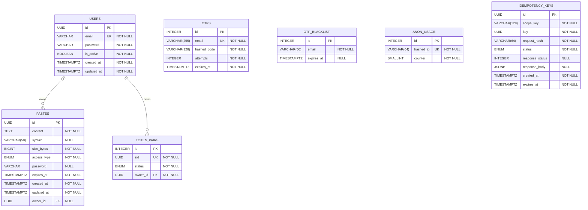

```mermaid
erDiagram
    USERS {
        UUID id PK
        VARCHAR email UK "NOT NULL"
        VARCHAR password "NOT NULL"
        BOOLEAN is_active "NOT NULL"
        TIMESTAMPTZ created_at "NOT NULL"
        TIMESTAMPTZ updated_at "NOT NULL"
    }

    PASTES {
        UUID id PK
        TEXT content "NOT NULL"
        VARCHAR(50) syntax "NULL"
        BIGINT size_bytes "NOT NULL"
        ENUM access_type "NOT NULL"
        VARCHAR password "NULL"
        TIMESTAMPTZ expires_at "NOT NULL"
        TIMESTAMPTZ created_at "NOT NULL"
        TIMESTAMPTZ updated_at "NOT NULL"
        UUID owner_id FK "NULL"
    }

    OTPS {
        INTEGER id PK
        VARCHAR(255) email UK "NOT NULL"
        VARCHAR(128) hashed_code "NOT NULL"
        INTEGER attempts "NOT NULL"
        TIMESTAMPTZ expires_at "NOT NULL"
    }

    OTP_BLACKLIST {
        INTEGER id PK
        VARCHAR(50) email "NOT NULL"
        TIMESTAMPTZ expires_at "NULL"
    }

    TOKEN_PAIRS {
        INTEGER id PK
        UUID sid UK "NOT NULL"
        ENUM status "NOT NULL"
        UUID owner_id FK "NOT NULL"
    }

    ANON_USAGE {
        INTEGER id PK
        VARCHAR(64) hashed_ip UK "NOT NULL"
        SMALLINT counter "NOT NULL"
    }

    IDEMPOTENCY_KEYS {
        UUID id PK
        VARCHAR(128) scope_key "NOT NULL"
        UUID key "NOT NULL"
        VARCHAR(64) request_hash "NOT NULL"
        ENUM status "NOT NULL"
        INTEGER response_status "NULL"
        JSONB response_body "NULL"
        TIMESTAMPTZ created_at "NOT NULL"
        TIMESTAMPTZ expires_at "NOT NULL"
    }

    USERS o|--o{ PASTES : owns
    USERS ||--o{ TOKEN_PAIRS : owns
```